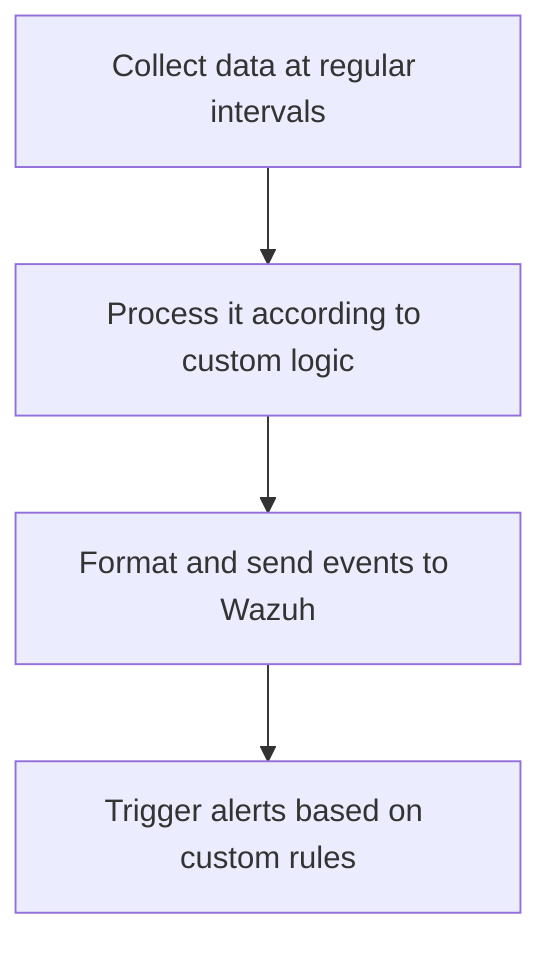
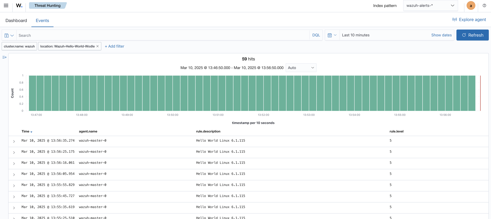

+++
date = '2025-03-02T17:10:46Z'
draft = false
title = 'Building Custom Wazuh Wodles'
tags = ['security-engineering', 'security-monitoring', 'siem', 'wazuh']
+++

## Extending Beyond the Defaults


  This post focuses on [Wazuh](https://wazuh.com), a unified Security Information and Event Management (SIEM) and Extended Detection and Response (XDR) platform that has become increasingly popular as a powerful open-source solution for security monitoring and threat detection.


Security monitoring tools come with out-of-the-box support for common log sources, but what about those critical events happening in your custom applications? While these tools excel at tracking standard system logs, they can miss the unique data sources and formats that matter in your particular environment.

Wazuh addresses this challenge with [wodles](https://documentation.wazuh.com/current/user-manual/reference/ossec-conf/wodle-command.html), a flexible framework that can be used to extend Wazuh's reach.

## What are Wodles?

Wodles are lightweight modules for extending Wazuh's monitoring capabilities. Think of them as specialised sensors that collect data from various sources, process it according to your requirements, and ultimately trigger alerts based on custom rules.

 A typical wodle follows this pattern:



Running as independent processes under the [Wazuh manager's](https://documentation.wazuh.com/current/user-manual/manager/wazuh-manager.html) supervision, wodles allow you to shape the tool around your unique security requirements.

### Core vs Custom Wodles

Wazuh ships with several built-in wodles, such as:

- [aws-s3](https://documentation.wazuh.com/current/user-manual/reference/ossec-conf/wodle-s3.html) for collecting AWS-related logs from AWS S3
- [syscollector](https://documentation.wazuh.com/current/user-manual/reference/ossec-conf/wodle-syscollector.html) for collecting system inventory data
- [docker-listener](https://documentation.wazuh.com/current/user-manual/reference/ossec-conf/wodle-docker.html) for collecting Docker events
- [command](https://documentation.wazuh.com/current/user-manual/reference/ossec-conf/wodle-command.html) for executing external commands

Now, the real magic lies in the `command` wodle as it can be used to run your own commands or scripts, opening up possibilities for integrating custom data sources and formats.

## Creating a Custom Wodle

Let's explore how to use the `command` wodle with a simple toy example that runs a script at a given interval to generate alerts for our custom data source.

### Custom Script

This Python implementation demonstrates the monitoring pattern. In this example, the script collects kernel version information and sends it to Wazuh as a custom event, but the same approach could be adapted to monitor any custom data source:

```python {filename="hello_world_wodle.py"}
#!/usr/bin/env python3
import json
import subprocess
from socket import socket, AF_UNIX, SOCK_DGRAM

# Function to send event to Wazuh manager
def send_event(event):
    sock = None
    try:
        # Create a Unix socket to the Wazuh queue and send the event as bytes
        sock = socket(AF_UNIX, SOCK_DGRAM)
        sock.connect("/var/ossec/queue/sockets/queue")
        sock.send(event.encode())
        print(f"Sent: {event}")
    except Exception as e:
        print(f"Error sending event: {e}")
    finally:
        if sock:
            sock.close()

# Main function
def main():
    print("Starting Hello World wodle")

    try:
        # Get kernel name (e.g., Linux, Darwin) and release/version
        kernel_name = subprocess.check_output(["uname", "-s"], universal_newlines=True).strip()
        kernel_release = subprocess.check_output(["uname", "-r"], universal_newlines=True).strip()

        # Concatenate kernel information
        kernel_info = f"{kernel_name} {kernel_release}"

        # Create event data
        event_data = {
            "kernel_info": kernel_info,
            "wodle": "hello-world"
        }

        # Convert to string and add prefix before sending
        send_event(f"1:Wazuh-Hello-World-Wodle:{json.dumps(event_data)}")
    except Exception as e:
        print(f"Error: {e}")

if __name__ == "__main__":
    main()
```


  The event is formatted as a JSON string and prefixed with `1:Wazuh-Hello-World-Wodle:<Event Data>` to ensure it's correctly parsed by Wazuh, following the [standard OSSEC message format](https://documentation.wazuh.com/current/development/message-format.html): `<Queue>:<Location>:<Message>`.


Save this as `hello_world_wodle.py` in the wodles directory, e.g., `/var/ossec/wodles/` and make sure it's executable:

```bash
sudo chmod +x /var/ossec/wodles/hello_world_wodle.py
```

### Custom Rule

As `hello_world_wodle.py` generates a custom log, there likely won't be an [existing rule](https://github.com/wazuh/wazuh/tree/main/ruleset/rules/) that matches it, so we need to create a custom rule. To do this, edit `/var/ossec/etc/rules/local_rules.xml` and add the following rule:

```xml {filename="local_rules.xml"}
<!-- Add a local rule for the custom wodle -->
<group name="local,custom">
  <rule id="100999" level="5">
    <decoded_as>json</decoded_as>
    <field name="wodle">hello-world</field>
    <description>Hello, World! $(kernel_info)</description>
  </rule>
</group>
```

This rule will trigger an alert when the script sends an event with the `wodle` field set to `hello-world`. You can configure the rule to trigger on specific conditions or fields in the event data relevant to your data. The entire event will be parsed as JSON, and the `kernel_info` field will be extracted and included in the alert description.


  Rule order matters in Wazuh. Placing custom rules after existing rules with similar triggers can cause custom rules to be ignored.




  Rule level matters in Wazuh. If the [rule level](https://documentation.wazuh.com/current/user-manual/ruleset/rules/rules-classification.html) is between 0-2, the alert won't be shown in the Wazuh app.


### Wazuh Configuration

Configure Wazuh to use a `command` wodle that invokes `hello_world_wodle.py` at routine intervals, do this by updating `ossec.conf` (usually located in `/var/ossec/etc/`):

```xml {filename="ossec.conf"}
<!-- Add this in the global section -->
<wodle name="command">
  <command>python3 /var/ossec/wodles/hello_world_wodle.py</command>
  <disabled>no</disabled>
  <interval>1m</interval>
  <run_on_start>yes</run_on_start>
  <tag>hello-world</tag>
  <timeout>0</timeout>
</wodle>
```

### Deployment Process

After creating and configuring the custom wodle and rule, restart the Wazuh manager to apply the changes:

```bash
sudo systemctl restart wazuh-manager # or /var/ossec/bin/wazuh-control restart
```

### Verification

To verify that the custom wodle is working as expected, tail the Wazuh logs in `/var/ossec/logs/`:

```bash
sudo tail -f /var/ossec/logs/ossec.log
sudo tail -f /var/ossec/logs/alerts/alerts.log
```

The `ossec.log` will give you system-level information, including wodle execution:

```bash
2025/03/02 13:49:05 wazuh-modulesd:command: INFO: Starting command 'hello-world'.
```

While the `alerts.log` will show the alerts generated by the custom rule.

```json
{
  "timestamp": "2025-03-02T13:52:55.842+0000",
  "rule": {
    "level": 5,
    "description": "Hello World Linux 6.1.115",
    "id": "100999",
    "firedtimes": 68,
    "mail": false,
    "groups": [
      "local",
      "customcustom_script"
    ]
  },
  "agent": {
    "id": "000",
    "name": "wazuh-master-0"
  },
  "manager": {
    "name": "wazuh-master-0"
  },
  "id": "1741614775.2011495142",
  "cluster": {
    "name": "wazuh",
    "node": "wazuh-manager-master"
  },
  "full_log": "{\"kernel_info\": \"Linux 6.1.115\", \"wodle\": \"hello-world\"}",
  "decoder": {
    "name": "json"
  },
  "data": {
    "kernel_info": "Linux 6.1.115",
    "wodle": "hello-world"
  },
  "location": "Wazuh-Hello-World-Wodle"
}
```

And that's it! You've successfully created a custom wodle that extends Wazuh's monitoring capabilities to include your custom data source.



## Conclusion

The steps for creating custom wodles are straightforward: write a custom script to collect and format your data, create a custom rule to trigger on the specific conditions you care about, and update your Wazuh configuration to run the Wodle.

Wazuh's documentation makes the learning curve much gentler, with clear examples and thorough explanations of its internal workings.

Custom wodles are a game-changer for security monitoring. By creating your own wodles, you can keep an eye on non-standard systems in ways that generic tools can't and catch security events faster by monitoring exactly what matters to you.